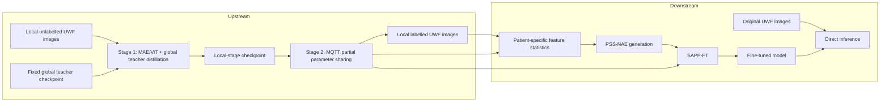

# DeepUWF 👁️

>  A Decentralized Framework for Privacy-Preserving Development of Medical Foundation Models

We present an end-to-end privacy-aware decentralized framework spanning the key FM development lifecycle of pretraining and fine-tuning, and demonstrate the clinical utility of this framework using ultra-widefield (UWF) retinal imaging as an exemplar. The **Upstream** workflow first learns locally from unlabelled UWF images with global knowledge distillation, then enables privacy-aware decentralized collaboration through MQTT and partial parameter sharing. The **Downstream** workflow introduces subject-aware privacy-preserving fine-tuning (SAPP-FT), which replaces labelled retinal images with patient- and sample-specific noise-like representations that preserve diagnostic information for downstream model adaptation.

## ✨ Highlights

| Component | What it provides |
| --- | --- |
| 🧠 Local semi-supervised learning | MAE/ViT masked-image-modeling on unlabelled local UWF images, with a fixed global teacher for knowledge distillation. |
| 🌐 Decentralized collaboration | MQTT-based exchange of selected floating-point model tensors; sample-count weighted aggregation keeps raw data local. |
| 🔐 Privacy-preserving downstream learning | SAPP-FT generates patient- and sample-specific noise-like representations for downstream model adaptation, with privacy evaluated against membership inference and image reconstruction attacks. |
| 🗂️ Minimal examples | A small, format-only UWF example dataset for understanding expected inputs; it is not an evaluation dataset. |



## 🧭 Repository layout

```text
.
├── Upstream/                         # Foundation-model workflow
│   ├── core/                         # MAE/ViT training code
│   ├── federated/                    # MQTT transport and partial aggregation
│   └── run_pretraining.sh            # MIM-only baseline template
├── Downstream/                       # Privacy-preserving downstream workflow
│   ├── DP/                           # No-protection/DP/SAPP fine-tuning; PSS-NAE generation
│   ├── MIA_attack/                   # Confidence-based/gradient-based/robust membership inference attack
│   ├── pairAttack/                   # Known-plaintext image reconstruction attack
├── MinimumDataset/                   # Format-only examples; not for benchmarking
├── requirements.txt
└── LICENSE

```

## ⚙️ Installation

Use Python 3.8+ and install a CUDA-enabled PyTorch build compatible with your driver before installing the remaining dependencies.

```bash
git clone https://github.com/DeepUWF/DeepUWF.git
cd DeepUWF
python -m venv .venv
source .venv/bin/activate
pip install --upgrade pip
pip install -r requirements.txt
```

The original implementation was developed with `timm==0.3.2`; retain this version for checkpoint compatibility. CPU execution is suitable only for smoke tests; 448 × 448 MAE/ViT training requires a CUDA GPU in practice.

## 🗃️ Data formats

### 🧪 Minimal example dataset

[`MinimumDataset/`](MinimumDataset/README.md) contains 30 project-provided UWF images and a CSV label example. It illustrates the expected data semantics only; it is **not** a train/test split, a benchmark, or a clinical evaluation cohort. Read its dedicated README before use.

### 🖼️ Upstream local images

Stage 1 discovers common image formats recursively, so unlabelled images can be arranged by site or any other local hierarchy:

```text
/local/uwf_unlabelled/
├── hospital_a/
│   ├── 000001.jpg
│   └── 000002.jpg
└── hospital_b/
    └── 000003.png
```

### 🏷️ Downstream privacy-protected images

SAPP-FT uses labelled local privacy-preserving UWF images organized in PyTorch ImageFolder format. Class directory names define the label mapping.


```text
MinimumDataset/Fine-tuning/Protected SHDR
├── class_0/
└── class_1/
```

## 🧠 Upstream workflow

The upstream procedure has two explicit stages. Complete Stage 1 at every participating centre before starting Stage 2.

### 1️⃣ Stage 1 — Local semi-supervised learning with global knowledge distillation

Each centre trains a MAE/ViT backbone on its own unlabelled UWF images. A fixed global teacher provides pseudo-label knowledge during local training. The global-teacher checkpoint is supplied externally and must use the same architecture, label order, and class count at every centre.

```bash
python Upstream/core/train.py --pretrain \
  --distillation \
  --teacher_model resnet50 \
  --teacher_chkpt /secure/global_teacher_checkpoint.pth \
  --num_classes 2 \
  --model mae_vit_large_patch16 \
  --input_size 448 \
  --batch_size 16 \
  --num_workers 8 \
  --blr 1e-3 \
  --epochs 800 \
  --warmup_epochs 50 \
  --data_path /local/uwf_unlabelled \
  --task site_a_stage1 \
  --output_dir checkpoints/site_a_stage1 \
  --log_dir logs/site_a_stage1 \
  --device cuda
```

The training loop combines masked-image-modeling loss with the teacher-derived distillation loss. `--chkpt_path` is optional and can initialise this stage from a compatible MAE checkpoint. For a MIM-only baseline without knowledge distillation, edit and run `Upstream/run_pretraining.sh`.

### 2️⃣ Stage 2 — Privacy-aware decentralized collaboration

Every centre begins from its Stage-1 checkpoint, performs local training, and publishes only a randomly selected fraction of floating-point state tensors. MQTT messages can arrive asynchronously within a collection window; available peer tensors are aggregated using the contributors' sample counts. Raw images, labels, and teacher checkpoints are not sent through the transport.

```bash
python Upstream/core/train.py --pretrain --federated \
  --client-id hospital_a \
  --run-id uwf-pretrain-001 \
  --mqtt-host broker.example.org \
  --mqtt-port 8883 \
  --mqtt-topic deepuwf \
  --mqtt-qos 1 \
  --mqtt-tls \
  --mqtt-ca-cert /secure/ca.pem \
  --mqtt-cert /secure/hospital_a.crt \
  --mqtt-key /secure/hospital_a.key \
  --share-fraction 0.2 \
  --min-peer-updates 1 \
  --mqtt-wait-seconds 60 \
  --model mae_vit_large_patch16 \
  --input_size 448 \
  --batch_size 16 \
  --epochs 800 \
  --chkpt_path /local/checkpoints/site_a_stage1/checkpoint-last.pth \
  --data_path /local/uwf_unlabelled \
  --task uwf_pretrain_federated \
  --output_dir checkpoints/site_a_federated \
  --log_dir logs/site_a_federated \
  --device cuda
```

| Option | Meaning |
| --- | --- |
| `--client-id` | Unique identifier for one participating centre. |
| `--run-id` | Shared identifier that isolates one collaboration run on the broker. |
| `--share-fraction` | Fraction of floating-point state tensors selected for one exchange round. |
| `--min-peer-updates` | Minimum number of peer updates to collect before aggregation. |
| `--mqtt-wait-seconds` | Maximum message-collection window for one round. |
| `--mqtt-tls` and certificate options | Enable mutual TLS. Use a broker with per-site authentication and topic ACLs. |

Run one process per participating site/GPU. Do not combine `--federated` with `torchrun`.

## 🔐 Downstream workflow

See [`Downstream/README.md`](...) for detailed commands and configurations.

### 1️⃣ Construct patient- and sample-specific feature targets

Multi-layer representations are first extracted from the labelled local UWF images using the pretrained foundation model. Patient-eye prototypes and population-level residual subspaces are then estimated to construct patient- and sample-specific feature targets.

### 2️⃣ Generate PSS-NAEs

Each PSS-NAE is initialized from random noise and optimized toward the corresponding multi-layer feature targets while constraining its deviation from the initial noise. The resulting privacy-preserving image retains diagnostically relevant representations without directly exposing the original retinal image.

### 3️⃣ Fine-tune using PSS-NAEs

The generated PSS-NAEs and their labels are used to fine-tune the collaboratively pretrained foundation model. Original labelled retinal images remain local and are not required as direct fine-tuning inputs.

### 4️⃣ Direct inference on original images

At inference time, the fine-tuned model directly processes original UWF images. PSS-NAE generation, image reconstruction, and decryption are not required during inference.

## 🛡️ Privacy evaluation

We evaluate privacy leakage using four membership inference settings and an image reconstruction attack.

See [`Downstream/README.md`](...) for detailed commands and configurations.

### Membership inference

- Confidence-based MIA
- Gradient-based MIA
- Robust Membership Inference Attack (RMIA)
- Patient-level RMIA

The patient-level evaluation aggregates record-level RMIA scores within each patient and evaluates membership distinguishability on a strict patient-disjoint subset.

### Image reconstruction

A U-Net-based attacker is trained using paired original and privacy-preserving images and subsequently attempts to reconstruct the original retinal images from PSS-NAEs.

## ✅ Reproducibility checklist

For every experiment, record:

- random seed, site-specific split, class-to-index mapping, and image preprocessing;
- model and teacher checkpoint versions;
- local and effective batch sizes, GPU count, and all optimiser settings;
- MQTT run identifier, selected-sharing fraction, wait window, and participating centres;
- SAPP/PSS-NAE target-construction parameters, noise initialization, optimization settings, proximity-regularization weight, and generation seed;
- privacy-attack configuration, reference-model settings, RMIA parameters, patient-level aggregation protocol, and reconstruction-attack settings;
- evaluation protocol, number of repeated seeds, and confidence-interval method.

## 🛡️ Privacy and security boundaries

- Raw UWF images, labels, certificates, and private teacher checkpoints must remain on authorised local infrastructure.
- MQTT mutual TLS protects the transport channel. Configure broker-side authentication and topic ACLs independently.
- Partial parameter sharing and transport encryption are not equivalent to secure aggregation or a formal guarantee against model-update leakage.
- SAPP-FT is an empirical privacy-preserving learning approach and does not provide a formal differential-privacy guarantee. Its privacy properties are evaluated empirically against membership inference and image reconstruction attacks.
- Never commit patient images, metadata, private keys, credentials, experiment logs, or model weights beyond the explicitly provided minimal examples.

## 📌 Scope and current limitations

This repository includes the local distillation, MQTT partial-sharing, SAPP fine-tuning, differential-privacy comparators, and privacy evaluation against membership inference and image reconstruction attacks. It does not include the manuscript's bootstrap statistical analysis, or explainability pipelines. Those experiments cannot be reproduced from this repository alone.

## 📜 License and provenance

This repository is distributed under the **Creative Commons Attribution–NonCommercial 4.0 International (CC BY-NC 4.0)** license. See [LICENSE](LICENSE) for the complete terms.
